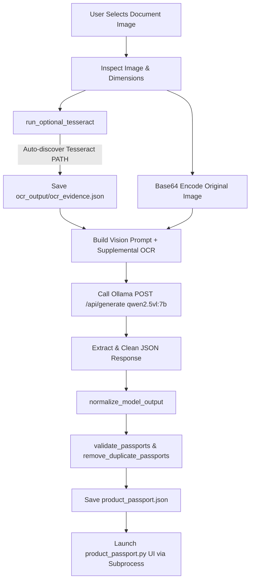
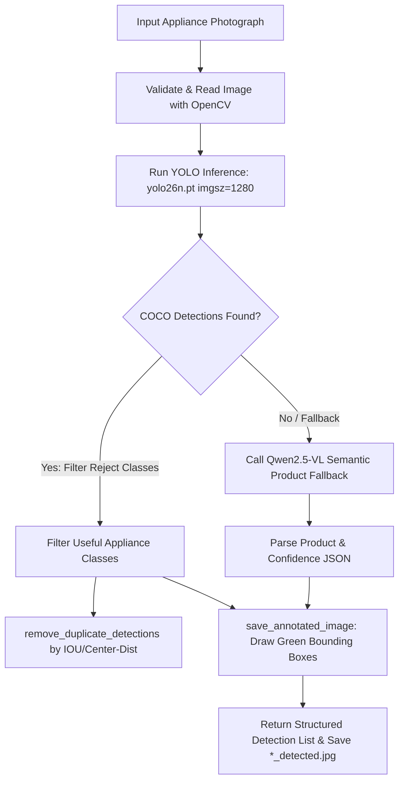

# CLAUDE.md - Textemage Digital Product Passport (DPP) & Vision AI

Comprehensive developer and agent reference for the **Textemage** Digital Product Passport & Appliance Detection codebase.

---

## 1. Project Overview

**Textemage** is an AI-powered document intelligence and computer vision platform designed to generate standardized **Digital Product Passports (DPP)** from physical documents (warranty cards, purchase receipts, invoices, product labels) and physical appliance photographs.

### Key Capabilities
- **Document Understanding & Checkbox Reasoning:** Analyzes multi-product warranty documents and receipts; identifies explicitly checked/selected checkboxes (`[✓]`, `[X]`, ticks) to distinguish purchased items from printed category lists.
- **Multi-Product Passport Isolation:** Generates independent, non-merged passports for multiple purchased products found within a single document.
- **Hybrid Appliance Localization:** Combines YOLO (`yolo26n.pt`) bounding-box detection with Ollama `qwen2.5vl:7b` semantic fallback for appliance verification.
- **Multi-Variant OCR Preprocessing:** Generates image enhancement variants (grayscale, contrast boost, unsharp mask, adaptive thresholding) and extracts text/bounding boxes via Tesseract or PaddleOCR as auxiliary evidence.
- **Certificate-Style UI:** Interactive desktop viewer styled with a luxury navy/gold theme, security seals, barcode graphics, and metadata grids.
- **Document Database:** Local JSON persistence engine with unique ID generation (`PP-YYYYMMDDHHMMSS-X`), image attachment, and detection linkage.

---

## 2. Technology Stack

| Layer | Technologies |
|---|---|
| **Language & Runtime** | Python 3.10+ |
| **Vision-Language Model (VLM)** | Ollama `qwen2.5vl:7b` (local multimodal inference at `http://127.0.0.1:11434`) |
| **Object Detection & CV** | Ultralytics YOLO (`yolo26n.pt`), OpenCV (`cv2`) |
| **OCR Engines** | Tesseract OCR (`pytesseract`), PaddleOCR (optional fallback) |
| **Image Processing** | Pillow (`PIL`), NumPy |
| **GUI Framework** | Tkinter, CustomTkinter |
| **Validation & Data** | Pydantic, standard `json` |
| **HTTP Client** | `requests`, `httpx` |

---

## 3. Project File Structure & Inventory

```
c:\Users\acer\Documents\Hackathon_idea-main\
├── .gitignore                   # Root gitignore (ignores __pycache__, ocr_output, etc.)
├── CLAUDE.md                    # This architecture and codebase guide
├── README.md                    # Project documentation & user guide
├── requirements.txt             # Standardized dependency list
├── main.py                      # Interactive CLI launcher for all modules
├── Textemage.py                 # Root delegate launcher for the main pipeline
└── Hackathon_idea-main/
    ├── Textemage.py             # Primary pipeline: GUI document picker → OCR → VLM → UI
    ├── product_passport.py      # Tkinter/Canvas certificate-style Passport Viewer UI
    ├── product_detector.py      # YOLO + Qwen appliance detector & annotator
    ├── ocr_engine.py            # Image preprocessing pipeline & OCR evidence builder
    ├── extract_product.py       # Multi-product extraction engine & date/price normalizers
    ├── passport_store.py        # Local JSON document database manager
    ├── test_ocr.py              # OCR test & diagnostic script
    ├── _make_icon.py            # PNG icon generator utility
    ├── yolo26n.pt               # YOLO neural network weights file
    ├── tesseract_path.txt       # Custom Tesseract binary path configuration
    ├── requirements.txt         # Subfolder dependency specifications
    ├── requirments.txt          # Legacy requirements file
    ├── ocr_output/              # Generated OCR evidence and passport JSON outputs
    └── sample images            # hi.png, image.png, image1.png, image2.png, img.jpg, img3.jpg, ocr check.webp
```

---

## 4. End-to-End Execution Flows & Pipelines

### Flow 1: Document to Digital Product Passport (`Textemage.py`)



#### Step Details:
1. **Image Selection:** `select_image()` uses a top-level Tkinter file dialog supporting PNG, JPG, JPEG, WEBP, BMP, TIFF.
2. **Auxiliary OCR:** `run_optional_tesseract()` generates supplementary text without blocking execution if OCR is absent.
3. **VLM Prompting:** Sends full-resolution image base64 and strict schema constraints to Ollama `qwen2.5vl:7b` (zero temperature).
4. **Checkbox Reasoning:** The VLM identifies only verified checkmarks (`[✓]`, `[X]`, handwritten marks) to filter out unselected categories.
5. **Normalization:** Strips null-equivalents (`"N/A"`, `"none"`, `"unknown"`), formats ISO dates (`YYYY-MM-DD`), and normalizes currency/prices.
6. **Display:** Launches `product_passport.py` targeting the exact output JSON.

---

### Flow 2: Physical Appliance Localization (`product_detector.py`)



#### Step Details:
1. **YOLO Detection:** Runs `yolo26n.pt` with confidence threshold `0.10` and NMS IoU `0.45` at 1280px resolution.
2. **Appliance Filtering:** Whitelists appliances (`refrigerator`, `microwave`, `oven`, `toaster`, `tv`, `laptop`, `vacuum`, etc.) and rejects noise (`person`, `backpack`, `dog`, `car`, etc.).
3. **Semantic Fallback:** If YOLO finds no matching appliance (e.g. washing machines not in standard COCO classes), calls Qwen2.5-VL to semantically classify the appliance.
4. **Image Output:** Saves annotated bounding-box visual to `<filename>_detected.jpg`.

---

## 5. Data Schemas

### Digital Product Passport Schema (`product_passport.json`)

```json
{
  "source_image": "C:\\path\\to\\document.jpg",
  "passport_count": 1,
  "passports": [
    {
      "passport_id": "PP-20260902140000-1",
      "document_type": "warranty_card",
      "product": "Small Domestic Appliances",
      "brand": "Electrolux",
      "model": "EAP150",
      "serial_number": "SN89234710",
      "purchase_price": 198.0,
      "currency": "RM",
      "purchase_date": "2023-08-24",
      "warranty": "2-YEAR",
      "seller": "Best Electrical Store",
      "category": "Small Domestic Appliances",
      "customer_name": "John Doe",
      "order_id": null,
      "invoice_number": "INV-2023-001",
      "selection": "checked",
      "evidence": "Checkbox beside Small Domestic Appliances is visibly marked.",
      "product_images": [],
      "linked_products": [],
      "created_at": "2026-09-02T14:00:00.000000"
    }
  ]
}
```

### OCR Evidence Schema (`ocr_output/ocr_evidence.json`)

```json
{
  "image": "C:\\path\\to\\image.jpg",
  "ocr_text": "Extracted text content...",
  "ocr_available": true
}
```

---

## 6. Development & Execution Workflows

### 1. Environment Setup
```powershell
# Install all required Python packages
python -m pip install -r requirements.txt
```

### 2. Ollama Setup
```powershell
# Pull the required Vision model
ollama pull qwen2.5vl:7b

# Start the Ollama local daemon (if not already running)
ollama serve
```

### 3. Launching Applications

- **Interactive Master Menu:**
  ```powershell
  python main.py
  ```
- **Document to Digital Passport:**
  ```powershell
  python Textemage.py
  ```
- **Appliance Detector:**
  ```powershell
  python Hackathon_idea-main/product_detector.py
  ```
- **Direct Passport Viewer UI:**
  ```powershell
  python Hackathon_idea-main/product_passport.py Hackathon_idea-main/product_passport.json
  ```
- **Run OCR Engine Test:**
  ```powershell
  python Hackathon_idea-main/test_ocr.py
  ```

---

## 7. Key Architectural Guidelines & Rules

1. **Path Resolution:** Always resolve file and directory paths relative to `__file__` (e.g. `BASE_DIR = Path(__file__).resolve().parent`) rather than assuming current working directory `Cwd`.
2. **VLM Zero-Hallucination Policy:** Prompting strictly instructs the Vision model to output `null` for any unreadable or unverified fields, preventing synthetic model/serial numbers.
3. **Graceful Degradation:** OCR (Tesseract/PaddleOCR) and YOLO are designed to fail gracefully. If Tesseract is unavailable, the pipeline continues seamlessly using direct VLM visual reasoning.
4. **Checkbox Discrimination:** Never convert an entire printed list of appliance categories into passports; only items with explicit handwritten/printed checks (`selection: "checked"`) qualify.
5. **No Cross-Product Leakage:** Multi-product documents must produce isolated passports per item without merging serial numbers or warranty terms.
